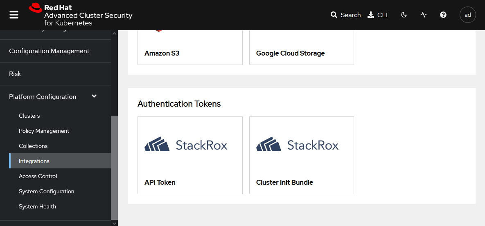
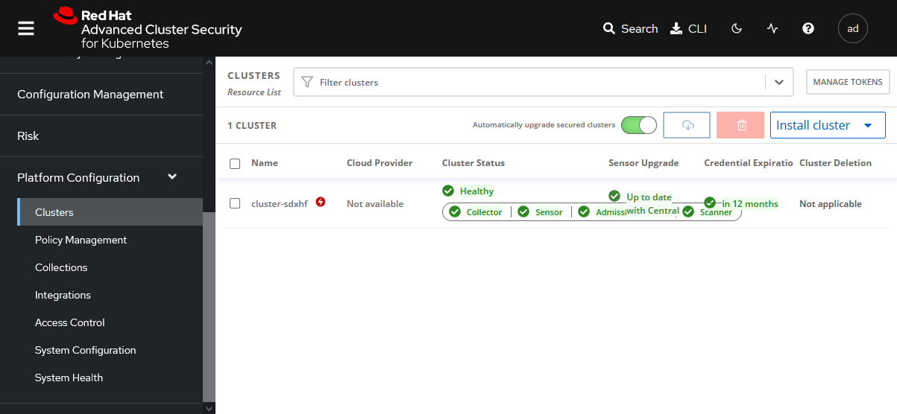

# RHACS Security Operation

## Application images security management with RHACS
Install and configure Red Hat Advanced Cluster Security for Kubernetes (RHACS), generate an
init bundle, and import a managed cluster. Create a policy to prevent the
deployment of vulnerable images.

### Requirements
- OpenShift 4.X (Tested on OCP4.12)

### RHACS Components
Red Hat Advanced Cluster Security for Kubernetes (RHACS) is composed of centralized services and secured cluster services. Centralized services run on a specific cluster and receive data from multiple secured cluster services. Secured cluster services require a small amount of resources compared to centralized services. Because RHACS uses this distributed architecture model, it supports large scale deployments that minimize impacts to the underlying infrastructure.

### RHACS Centralized Services

The RHACS centralized services run on a single cluster and include two main components, Central and Scanner.

**Central**
Central is the RHACS component that provides centralized services and the application management interface. Central handles data persistence, API interactions, and user interface access. You can secure multiple Red Hat OpenShift or Kubernetes clusters with a single Central instance.

**Scanner**
Scanner is a Red Hat developed vulnerability scanner. This service analyzes all the layers of the container images to find known Common Vulnerabilities and Exposures (CVEs). Scanner also identifies vulnerabilities in packages installed by package managers, language-level dependencies, and application-level dependencies.

To create all the elements of the RHACS centralized services, you must create a Central Kubernetes custom resource (CR). The RHACS operator defines this resource.

By default, RHACS installs a lightweight version of Scanner on each secured cluster to analyze the images in the integrated container registry.

### RHACS Secured Cluster Services

The RHACS secured cluster services run on each cluster secured by RHACS and include Sensor, Collector, Scanner, and Admission Controller.

**Sensor**
Sensor analyzes and monitors the cluster. This service interacts with the OpenShift or Kubernetes API server for policy detection and enforcement. Sensor coordinates with Collector.

**Collector**
Collector analyzes and monitors container activity on the nodes. This service collects information about network activity and the container runtime and sends the data to Sensor.

**Scanner**
Scanner, if installed, analyzes container images from the integrated container registry. 

**Admission Controller**
This service prevents the creation of workloads that violate RHACS security policies. 

To create all of the elements of the RHACS secured cluster services, you must create a SecuredCluster Kubernetes CR. The RHACS operator defines this resource.

### RHACS Architecture


#### Installing and Configuring RHACS

Log in to the ocp4 cluster as the admin user
```
# oc login -u <username> -p <password> https://api.<clusterID>.<BaseDoamin>:6443
```

Create namespace rhacs-operator.
First, review the file named rhacs-operator-namespace.yaml with the following contents:

```
apiVersion: v1
kind: Namespace
metadata:
  name: rhacs-operator
  annotations:
    openshift.io/node-selector: ""
    argocd.argoproj.io/sync-wave: "1"
  labels:
    openshift.io/cluster-monitoring: "true"
```

Then, create the NameSpace by using the oc command.

```
# oc create -f rhacs-operator-namespace.yaml
```

Create an operator group for the rhacs-operator namespace.
First, review the file named rhacs-og.yaml with the following contents:

```
apiVersion: operators.coreos.com/v1
kind: OperatorGroup
metadata:
  annotations:
    olm.providedAPIs: Central.v1alpha1.platform.stackrox.io,SecuredCluster.v1alpha1.platform.stackrox.io
    argocd.argoproj.io/sync-wave: "2"
  name: rhacs-operator
  namespace: rhacs-operator
spec:
  upgradeStrategy: Default
status: {}
```

Then, create the OperatorGroup object by using the oc command.

```
# oc create -f rhacs-og.yaml
```

Create a subscription to the Red Hat Advanced Cluster Security (RHACS) operator.
First, review the file named rhacs-sub.yaml with the following contents:

```
apiVersion: operators.coreos.com/v1alpha1
kind: Subscription
metadata:
  name: rhacs-operator
  namespace: rhacs-operator
  annotations:
    argocd.argoproj.io/sync-wave: "3"
spec:
  channel: stable
  installPlanApproval: Automatic
  name: rhacs-operator
  source: redhat-operators
  sourceNamespace: openshift-marketplace
status: {}
```

Then, create the Subscription object using the oc command.

```
# oc create -f rhacs-sub.yaml
```

Check the status of the available ClusterServiceVersion objects to verify the installation status. Wait until the PHASE column shows the Succeeded message.

```
# oc get csv -n rhacs-operator
NAME                    DISPLAY                                    VERSION   REPLACES   PHASE
rhacs-operator.v4.0.0   Advanced Cluster Security for Kubernetes   4.0.0                Succeeded
```

Create the stackrox namespace.

First, review the file named stackrox-namespace.yaml with the following contents:

```
apiVersion: v1
kind: Namespace
metadata:
  name: stackrox
  annotations:
    openshift.io/node-selector: ""
    argocd.argoproj.io/sync-wave: "1"
  labels:
    openshift.io/cluster-monitoring: "true"
```

Then, create the NameSpace by using the oc command.

```
# oc create -f stackrox-namespace.yaml
```

Create the RHACS Central object. 
Review the file named central.yaml containing the definition of the Central custom resource.

```
apiVersion: platform.stackrox.io/v1alpha1
kind: Central
metadata:
  name: stackrox-central-services
  namespace: stackrox
  annotations:
    argocd.argoproj.io/sync-wave: "4"
spec:
  central:
    exposure:
      loadBalancer:
        enabled: false
        port: 443
      nodePort:
        enabled: false
      route:
        enabled: true
    db:
      isEnabled: Default
      persistence:
        persistentVolumeClaim:
          claimName: central-db
    persistence:
      persistentVolumeClaim:
        claimName: stackrox-db
  egress:
    connectivityPolicy: Online
  scanner:
    analyzer:
      scaling:
        autoScaling: Enabled
        maxReplicas: 5
        minReplicas: 2
        replicas: 3
    scannerComponent: Enabled

```

Use the oc command to create the Central custom resource from the central.yaml file.

```
# oc create -f central.yaml
```

Wait until the MultiClusterHub object creates all its components. Use the watch
command to monitor the status.

```
# oc get central,po -n stackrox
```

Output:
```
NAME                                                     AGE
central.platform.stackrox.io/stackrox-central-services   4m15s

NAME                              READY   STATUS    RESTARTS   AGE
pod/central-5f67998b7c-hxgvv      1/1     Running   0          3m56s
pod/central-db-5f74c775d7-mwf69   1/1     Running   0          3m56s
pod/scanner-54b77f7574-6xxlk      1/1     Running   0          3m55s
pod/scanner-54b77f7574-89nmh      1/1     Running   0          3m56s
pod/scanner-54b77f7574-mc2sx      1/1     Running   0          3m55s
pod/scanner-db-5984857949-w7tkm   1/1     Running   0          3m55s
```

log in to the RHACS central dashboard as admin user.

Retrieve the default password for the admin user from the command line.
```
oc -n stackrox get secret central-htpasswd -o go-template='{{index .data "password" | base64decode}}'
```

Output:
```
XXXZbeB0DCbF5oCIChn8lsXXX
```

Run the oc get route command to retrieve the URL of the RHACS web console.
```
# oc get route -n stackrox
```

Output:
```
NAME           HOST/PORT                                                           PATH   SERVICES   PORT    TERMINATION   WILDCARD
central        central-stackrox.apps.<clusterID>.<BaseDomain>         central    https   passthrough   None
central-mtls   central.stackrox                                                           central    https   passthrough   None
```

Open Firefox and access https://central-stackrox.apps.<clusterID>.<BaseDomain>

**Note:** If Firefox displays a warning message, then add exceptions to allow using the
CENTRAL_SERVICE certificate.

From the Select an auth provider list, click Login with username/password. Then, log
in as the admin user with the password retrieved in the preceding step.


#### Importing Secured Clusters to RHACS

When the Red Hat Advanced Cluster Security for Kubernetes (RHACS) Central instance is ready,
you can import secured clusters into RHACS.

Secured clusters require that the Central certificates communicate with the RHACS centralized services. A bundle named init bundle contains these certificates.

Generating an Init Bundle

The init bundle contains the Central server certificates. You must import these certificates to every secured cluster before creating the SecuredCluster resource. RHACS provides the Central certificates in the init bundle as a list of Kubernetes secrets in a YAML file.

From the RHACS web console, follow the steps below to generate the init bundle YAML files:

- Navigate to Platform Configuration > Integrations.
- Click Generate Bundle.


- Enter a name for the init bundle and click Generate.


- Click Download Kubernetes Secret File.


```
# ls -l
total 8
-rw-r--r--. 1 lab-user users 7871 May  8 03:40 cluster-init-bundle-cluster-init-secrets.yaml
```

The preceding steps generate and download a YAML file. Use that YAML file to create the secrets in the namespace where you plan to create the SecuredCluster resource. Import the same init bundle to every secured cluster in the namespace where the SecuredCluster resource resides.

Use the oc command to create the secrets from the init bundle download kubernetes secret file in stackrox namespace.

```
# oc create -f cluster-init-bundle-cluster-init-secrets.yaml -n stackrox
```

Output:
```
secret/admission-control-tls created
secret/collector-tls created
secret/sensor-tls created
```

#### Creating Secured Clusters

After importing the Central certificates by using the init bundle, you can import a cluster into
RHACS.

Create the SecuredCluster custom resource. 
Review the file named securecluster.yaml containing the definition of the SecuredCluster custom resource.

**Note:** Update centralEndpoint parameter to central URL with :<port> = 443 and clusterName for the name of cluster will show in RHACS

```
apiVersion: platform.stackrox.io/v1alpha1
kind: SecuredCluster
metadata:
  name: stackrox-secured-cluster-services
  namespace: stackrox
spec:
  clusterName: <ClusterName>
  auditLogs:
    collection: Auto
  centralEndpoint: central-stackrox.apps.<clusterID>.<BaseDomain>:443
  admissionControl:
    listenOnUpdates: true
    bypass: BreakGlassAnnotation
    contactImageScanners: DoNotScanInline
    listenOnCreates: true
    timeoutSeconds: 20
    listenOnEvents: true
  perNode:
    collector:
      collection: EBPF
      imageFlavor: Regular
    taintToleration: TolerateTaints
  scanner:
    analyzer:
      scaling:
        autoScaling: Enabled
        maxReplicas: 5
        minReplicas: 2
        replicas: 3
    scannerComponent: AutoSense
```

The secured cluster communicates with Central using the URL defined in the centralEndpoint key.

You can find the Central endpoint address on the Routes page, displayed from the Networking menu of the cluster that is running Central.

Alternatively, run the following command in the cluster that is running Central to retrieve the
Central endpoint:

```
NAME      HOST/PORT                                                           PATH   SERVICES   PORT    TERMINATION   WILDCARD
central   central-stackrox.apps.cluster-wbm7m.wbm7m.sandbox2609.opentlc.com          central    https   passthrough   None
```

Use the oc command to create the SecuredCluster custom resource from the securecluster.yaml file.
```
# oc create -f securecluster.yaml -n stackrox
```

Check admission-control and collector pods created in stackrox namespace.
```
# oc get po -n stackrox
```

Output:
```
NAME                                 READY   STATUS    RESTARTS   AGE
admission-control-66674dff7d-6wrh5   1/1     Running   0          76s
admission-control-66674dff7d-9b7gs   1/1     Running   0          76s
admission-control-66674dff7d-cqhhn   1/1     Running   0          76s
central-5f67998b7c-hxgvv             1/1     Running   0          58m
central-db-5f74c775d7-mwf69          1/1     Running   0          58m
collector-4b9xb                      3/3     Running   0          76s
collector-fq8hn                      3/3     Running   0          76s
collector-qnjxn                      3/3     Running   0          76s
collector-rdtd7                      3/3     Running   0          76s
scanner-54b77f7574-6xxlk             1/1     Running   0          58m
scanner-54b77f7574-mc2sx             1/1     Running   0          58m
scanner-db-5984857949-w7tkm          1/1     Running   0          58m
sensor-59d98b6bcf-g5z2z              1/1     Running   0          76s
```

Verify the clusters are imported successfully in RHACS.

- On the RHACS web console, navigate to Platform Configuration > Clusters to display
the CLUSTERS page. The CLUSTERS page displays the cluster.



**Note:** It takes 5-10 minutes for clusters to import to RHACS successfully with Healthy
status.

Run a compliance scan and review the result from RHACS dashboard.
- On the RHACS web console, navigate to Compliance to display the COMPLIANCE page.
- Click SCAN ENVIRONMENT to scan all the secured clusters. The COMPLIANCE dashboard shows results from the compliance report for the clusters.


- Click 1 CLUSTERS (Scanned) to see the Resource List.
- Click cluster name to view more details for the cluster compliance scan.


You can click the different dashboards to obtain more details about the compliance scan results.

#### Create an RHACS policy to prevent the deployment of vulnerable images.

Create an RHACS policy to prevent the deployment of images by using the latest tag from
the central registry.

- From the RHACS web console, navigate to Platform Configuration > Policies Mangement.
- Click Create policy.


- On the Policy details page, add the following parameters:

| Field name             | Value                    |
| :--------------------- | :----------------------- |
| Name                   | latest-tag-policy        |
| Severity               | High                     |
| Categories             | Vulnerability Management |   


- And click Next.
- On the Policy behavior page, add the following parameters:

| Field name                      | Value                    |
| :------------------------------ | :----------------------- |
| Lifecycle stages                | Deploy                   |
| Response method                 | Inform and enforce       |
| Configure enforcement behavior  | Enforce on Deploy        |   


- Click Next.

- In the Drag out policy field pane, expand the Image registry list. Drag the Image tag tile to the Policy Section 1 list and type latest in the Image tag text field.
- Drag the Image registry tile to the Policy Section 1 list and type image registry URL in the Image pulled from registry text field.


- Click Next.
- On the Policy scope page, click Next.
- On the Review policy page, click Save to create the policy.


#### Deploy the application to test RHACS policy to prevent the deployment of images by using the latest tag from OpenShift internal image registry.

Log in to the ocp4 cluster as the admin user
```
# oc login -u <username> -p <password> https://api.<clusterID>.<BaseDoamin>:6443
```

Create project rhacs-policy-review for deploy application.
```
# oc new-project rhacs-policy-review
```

Create a Containerfile file containing a minimal image definition.
```
# vi Containerfile
FROM docker.io/openshift/hello-openshift:latest
```

Build the image using the podman build command.
```
# podman build . -t hello-app:latest
```

Output:
```
STEP 1/1: FROM docker.io/openshift/hello-openshift:latest
Trying to pull docker.io/openshift/hello-openshift:latest...
Getting image source signatures
Copying blob 8b32988996c5 done
Copying blob 4f4fb700ef54 done
Copying config 7af3297a3f done
Writing manifest to image destination
Storing signatures
COMMIT hello-app:latest
--> 7af3297a3fb
Successfully tagged localhost/hello-app:latest
Successfully tagged docker.io/openshift/hello-openshift:latest
7af3297a3fb4487b740ed6798163f618e6eddea1ee5fa0ba340329fcae31c8f6
```

Check the application image.
```
# podman images
```

Output:
```
REPOSITORY            TAG         IMAGE ID      CREATED      SIZE
localhost/hello-app                  latest      7af3297a3fb4  5 years ago  6.1 MB
docker.io/openshift/hello-openshift  latest      7af3297a3fb4  5 years ago  6.1 MB
```

Log in to the OpenShift image registry.
```
# podman login -u <username> -p $(oc whoami --show-token) default-route-openshift-image-registry.apps.<clusterID>.<BaseDoamin>
```

Push the application image for v10, v11, and latest tag to OpenShift image registry.
```
# podman push localhost/hello-app:latest default-route-openshift-image-registry.apps.<clusterID>.<BaseDoamin>/rhacs-policy-review/hello-app:v10
# podman push localhost/hello-app:latest default-route-openshift-image-registry.apps.<clusterID>.<BaseDoamin>/rhacs-policy-review/hello-app:v11
# podman push localhost/hello-app:latest default-route-openshift-image-registry.apps.<clusterID>.<BaseDoamin>/rhacs-policy-review/hello-app:latest
```

Output:
```
Getting image source signatures
Copying blob 971284b7358b done
Copying config 6db0a7e10f done
Writing manifest to image destination
Storing signatures
```

Check application image uploaded to OpenShift image registry.
```
# oc get is -n rhacs-policy-review
```

Output:
```
NAME        IMAGE REPOSITORY                                                                                                        TAGS             UPDATED
hello-app   default-route-openshift-image-registry.apps.<clusterID>.<BaseDoamin>/rhacs-policy-review/hello-app   latest,v11,v10   3 minutes ago
[root@bastion lab-user]#
```

Deploy application using the latest tag from OpenShift internal image registry.
Review the file named hello-app.yaml containing the definition of the application.

**Note:** Update image parameter to Image Repository URL with :<tag> = latest

```
apiVersion: apps/v1
kind: Deployment
metadata:
  labels:
    app: hello-app
  name: hello-app
  namespace: rhacs-policy-review
spec:
  progressDeadlineSeconds: 600
  replicas: 1
  revisionHistoryLimit: 10
  selector:
    matchLabels:
      deployment: hello-app
  strategy:
    rollingUpdate:
      maxSurge: 25%
      maxUnavailable: 25%
    type: RollingUpdate
  template:
    metadata:
      annotations:
        openshift.io/generated-by: OpenShiftNewApp
      creationTimestamp: null
      labels:
        deployment: hello-app
    spec:
      containers:
      - image: default-route-openshift-image-registry.apps.<clusterID>.<BaseDoamin>/rhacs-policy-review/hello-app:latest
        imagePullPolicy: IfNotPresent
        name: hello-app
        ports:
        - containerPort: 8080
          protocol: TCP
        - containerPort: 8888
          protocol: TCP
        resources: {}
        terminationMessagePath: /dev/termination-log
        terminationMessagePolicy: File
      dnsPolicy: ClusterFirst
      restartPolicy: Always
      schedulerName: default-scheduler
      securityContext: {}
      terminationGracePeriodSeconds: 30
status: {}
```

Use the oc command to create the application from the hello-app.yaml file.
```
# oc create -f hello-app.yaml
```

**Appication can't create because RHACS policy prevent the deployment of images by using the latest tag from OpenShift internal image registry.**

Output:
```
Warning: would violate PodSecurity "restricted:v1.24": allowPrivilegeEscalation != false (container "hello-app" must set securityContext.allowPrivilegeEscalation=false), unrestricted capabilities (container "hello-app" must set securityContext.capabilities.drop=["ALL"]), runAsNonRoot != true (pod or container "hello-app" must set securityContext.runAsNonRoot=true), seccompProfile (pod or container "hello-app" must set securityContext.seccompProfile.type to "RuntimeDefault" or "Localhost")
Error from server (Failed currently enforced policies from StackRox): error when creating "hello-app.yaml": admission webhook "policyeval.stackrox.io" denied the request:
The attempted operation violated 1 enforced policy, described below:

Policy: latest-tag-policy
- Description:
    ↳
- Rationale:
    ↳
- Remediation:
    ↳
- Violations:
    - Container 'hello-app' has image with registry 'default-route-openshift-image-registry.apps.cluster-wbm7m.wbm7m.sandbox2609.opentlc.com' and tag 'latest'

In case of emergency, add the annotation {"admission.stackrox.io/break-glass": "ticket-1234"} to your deployment with an updated ticket number
```

Change the image tag from latest to v10 in the hello-app.yaml file
```
# vi hello-app.yaml
...output omitted...
    spec:
      containers:
      - image: default-route-openshift-image-registry.apps.<clusterID>.<BaseDoamin>/rhacs-policy-review/hello-app:v10
        imagePullPolicy: IfNotPresent
        name: hello-app
        ports:

...output omitted...
```

Use the oc command to create the application from the hello-app.yaml file.
```
# oc create -f hello-app.yaml
```

Verify the status of the hello-app application.
```
# oc get deployment,po -n rhacs-policy-review
```

Output:
```
NAME                        READY   UP-TO-DATE   AVAILABLE   AGE
deployment.apps/hello-app   1/1     1            1           59s

NAME                             READY   STATUS    RESTARTS   AGE
pod/hello-app-6649d8d5dc-228qw   1/1     Running   0          59s
```

Expose hello-app application service
```
# oc expose svc hello-app
```

Test the hello-app application deployment.
```
# curl hello-app-rhacs-policy-review.apps.<clusterID>.<BaseDoamin>
```

Output:
```
Hello OpenShift!
```

